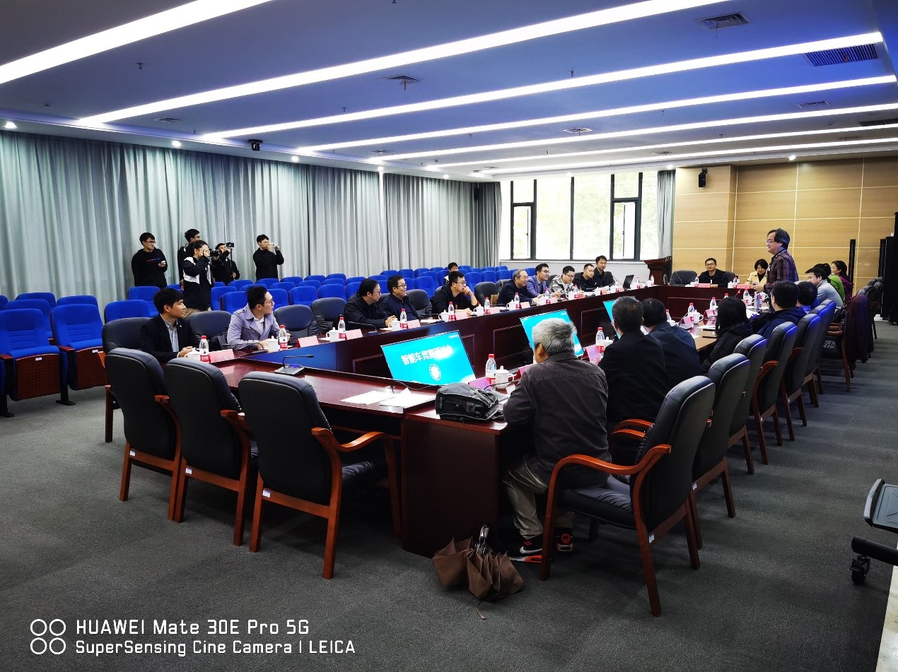
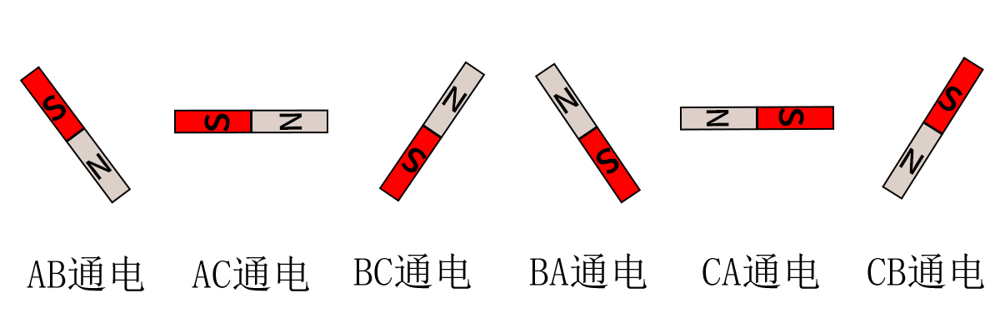
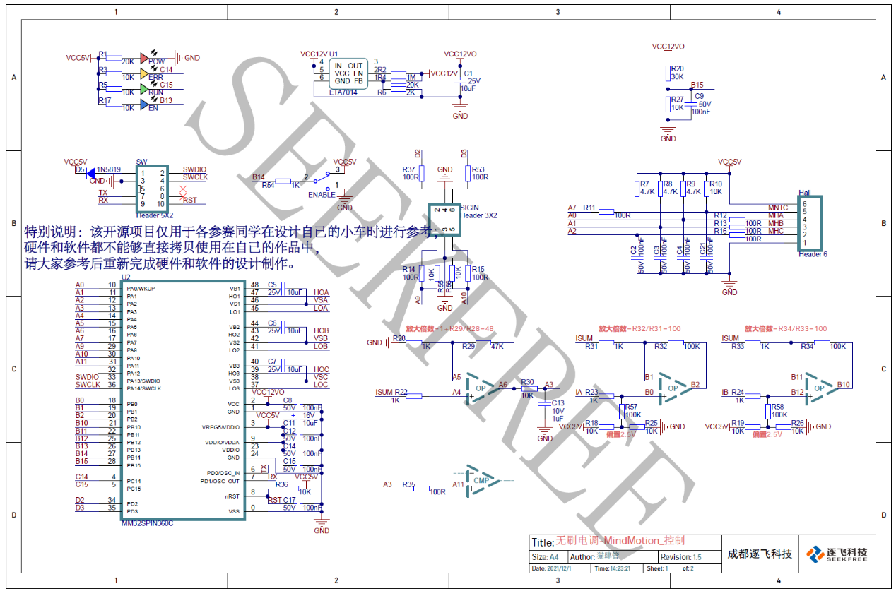
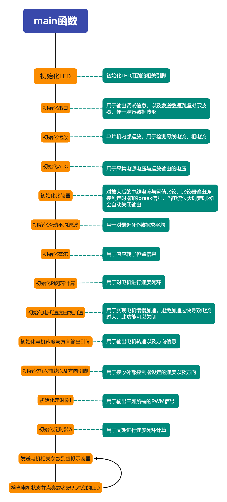
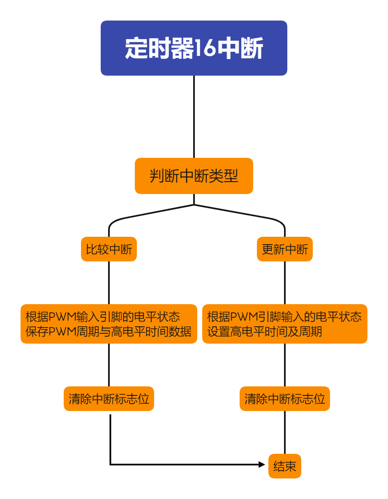
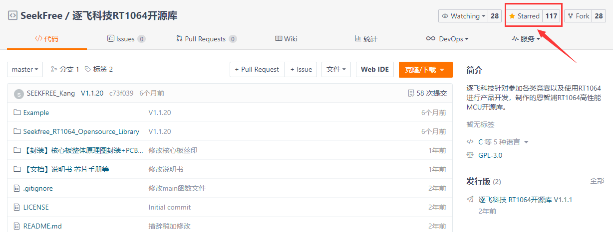

# 逐飞科技基于MM32SPIN360C的智能车BLDC开源项目

#### 一、前言
众所周知，第十七届全国大学生智能汽车竞赛有两个组别允许使用无刷电机，其中就包含极速越野组，允许将L车原有的540有刷电机更换为无刷电机，且无刷电机不指定，给了同学们新的选择。的确，无刷电机带来的性能提升肉眼可见，但其实540也不慢，使用也简单，所以如果新手选择了这个组别，也可以先从有刷调起，等其他部分都做到不错的阶段了，再换无刷来提升整个作品的竞争力也不迟。
规则发布后也引起了很多的讨论，其实汇聚到一个词就是--“军备竞赛”，是否会引起大家对价格高昂的无刷电机进行疯狂追逐，比拼经费，钱多的就成绩好呢？这期间组委会卓老师也经过了多番思考，在上周六我们在与卓老师进行无刷方案准备的讨论时也讨论到这个话题，我记不住原话了，大概意思是：从赛题的要求来看，其实追求无刷的极致的快和扭力并不能为稳定完成比赛带来多大的提高，一个合适的无刷电机就可以了，也就是说整个作品的上限并不是无刷电机的性能比拼，那么引入一个新的赛题何不开放更多的空间呢，不去指定，给同学们增加一个自主选择的环节，这个环节又何尝不是一个学习的过程呢，对与组委会来讲，新的赛题也是一种探索，更开放的规则更有利于迸发出更好的方案，有利于积累更多的经验，也是对同学们创造力的期待。从这个角度讲，不指定无刷电机的确是一种更好的方式。

那么究竟什么样的无刷电机是合适的呢，其实在参加完10月16日的研讨会后，卓老师已经在让我们进行验证，大家也可以从卓老师微信公众号和CSDN上看到一些我们测试的视频，这期间，我们对3650这种外形尺寸的多种参数的无刷电机进行了测试，从1760-7000+的Kv值总共测过不同厂家的十多个电机，实话讲，这波测试还是很花钱的，但其实结合咱们比赛实际的应用场景来看，并不需要太高的转速，经过实际的测试，我们认为让L车按照50km/h左右的理论速度上限来挑选无刷比较合适，这个转速参数下的扭力也完全足够，毕竟赛题的要求其实是力量与速度需要并存的，Kv值是指的每增加1V电压电机增加的转速，假设以额定电压12V，2500Kv值的电机为例，额定最高转速就是12*2500=30000R/m，Kv值的单位全称是Kv(RPM/volt)，更多关于无刷电机的参数的含义，大家可以自行查询，在本篇开源项目中会推荐一种我们认为比较合适的电机。

无刷电机的前奏聊得多了一点，接下来就是无刷电机怎么驱动的事了，讲真，无刷电机的使用比有刷电机的使用复杂了很多，这里不展开讲，相信你们自己会体会到，当你自己搞清楚原理，然后第一次让它顺畅的转起来，并且让它能转到它的额定转速，甚至超过它的额定转速时，你会很兴奋，因为他的转动是靠代码的精确设计逻辑来实现的，而不是有刷电机那样上电就能转的原理，所以组委会也是考虑到了其实用门槛，于是在10月18号到灵动微电子进行讨论时商定，由逐飞根据赛题要求，设计一套无刷驱动方案，并且开源给大家使用。这也便是今天的开源项目的来源，终于要开始讲今天的主题啦！

#### 二、逐飞科技基于MM32SPIN360C的智能车BLDC开源项目
受灵动微电子及组委会委托，逐飞科技作为灵动微电子大学计划官方合作伙伴，针对第十七届智能汽车竞赛室外极速组的BLDC应用需求，为参赛选手们精心设计了符合赛事需求的MM32 BLDC驱动开源方案供大家参考，该方案使用MM32SPIN360C，此单片机具有3个运放及3个比较器，无需外加运放与比较器。无刷电机为有感、内转子、2860KV、电压为12V。开源项目目前已实现电机正反转、内部速度闭环、支持刹车、支持电机加速度可调、支持堵转保护。

#### 2.1、无刷电机原理简介

在讲解本开源项目之前，还需要再简单科普一下无刷电机的原理，下面我们以三槽两极内转子电机进行讲解。
图1是无刷电机的基本模型示意，电机内部有三个线圈，每个线圈的一端都连接起来，另外一端引出到外部，中间有一个具有N/S两极的永磁铁内转子。

如果我们按照一定的顺序给电机通电，转子就可以旋转起来。我们举例几种给电的情况来进行简单分析和模拟：
a.给A通正电压，B通负电压。
A相产生的磁场会吸引转子的S极，B相线圈产生的磁场会吸引转子的N极，转子会转到向左倾斜的位置，如下图所示。（其中每一相产生的磁场我们需要使用右手螺旋定则判断磁场的南极与北极）

b. 给A通正电压，C通负电压。
A相产生的磁场会吸引转子的S极，C相线圈产生的磁场会吸引转子的N极，转子会转到水平位置，如下图所示。

c. 给B通正电压，C通负电压。
B相产生的磁场会吸引转子的S极，C相线圈产生的磁场会吸引转子的N极，转子会转到向右倾斜的位置，如下图所示。

d.给B通正电压，A通负电压。
B相产生的磁场会吸引转子的S极，A相线圈产生的磁场会吸引转子的N极，转子会转到向左倾斜的位置和a种情况类似但转子的南北极相反，如下图所示。

根据前四次的举例，我们可以得出第5、第6次也可以依次类推。
最终我们总结一下每次换相之后转子到达的位置，转动一圈需要换相6次，每次换相角度为60度，如下图所示

以上就是我们控制无刷电机转动的基本原理了，但是要真正的实现无刷电机的驱动，我们还缺少一个最重要的东西，就是如何知道转子已经到达预定位置，因为我们只有知道了转子到达了预定位置之后才能进行换相，这样电机才能顺滑的运转。转子位置检测常用的有三种方式。
方式一：通过过零检测，三相相电压与电机中性点电压进行比较，比较器输出的三路信号就类似于霍尔的三路信号一样。过零检测的优点在于电机与驱动连接的线较少，但是缺点在于启动的时候需要开环启动，会导致低速的时候控制效果差，并且硬件电路会更加复杂。当然也有其他办法使得在无感的方式下低速控制效果也不错，但是会大大增加软件上的复杂程度。

方式二：通过安装霍尔检测转子位置，一共安装三个霍尔分别间隔120度安装，霍尔输出的波形如下图所示(使用逻辑分析仪采集到的波形)，每当波形改变的时候就需要进行换相。优点是电路结构简单，缺点是电机成本会稍微高一点点。

方式三：加装磁编码器直接检测转子具体的位置。这种方式成本会高很多。

我们推荐选择方式二，采用霍尔检测转子的位置信息，驱动电路硬件会稍微简单一点，成本上也并未增加太多。我们推荐的有感无刷电机就是采用这种方式，使用这种电机，还可以节省下有刷电机闭环使用到的编码器，算下来反而更实惠。这一种方式可以得到转子位置信息，我们就可以通过位置信息来编写程序进行换相，然后就可以驱动无刷电机转动了。

#### 2.2、逐飞MM32 BLDC驱动开源项目的电机控制芯片选型

经过我们和灵动微电子的电机专家讨论，本次极速越野组推荐使用灵动的MM32SPIN360C驱动无刷电机。在我们前期验证时，灵动的电机专家朱工和丁工都给了我们很大的帮助，这其中也感谢灵动微电子大学计划负责人苏勇经理为我们协调资源，感谢灵动微电子为智能车竞赛提供的支持。

这款单片机特点如下：
1.使用高性能的 Arm® Cortex®-M0 为内核的 32 位微控制器。
2.最高工作频率可达 96MHz。
3.包含 12 位的 ADC，采样速度高达 1MHz。
4.通用定时器5 个、针对电机控制的 PWM 高级定时器2 个。
5. UART 接口2 个、I2C 接口1 个、SPI 接口2 个。
6.针对无刷电机应用内置 3 个运放，3 个比较器。
7.预驱工作电压高达 75V。

以下几个具有特点的功能介绍下。

PWM高级定时器1/8：
该芯片的TIMER1与TIMER8定时器，可以直接输出三路PWM信号或者是三路互补的PWM信号，当是互补的PWM信号时可以设置死区，无刷电机的三个半桥通过我们有三种驱动方式，方式一上桥给PWM信号下桥通过IO控制开启与关闭（逐飞本次开源项目即使用的这种方式）。方式二上桥通过IO控制开启与关闭下桥给PWM信号。方式三上下桥都给PWM信号，但是需要注意的是上下桥的PWM信号必须是互补的，因为上下桥不能同时导通，否则出现电源与地短路的情况，由于MOS开关具有延时，所以互补PWM信号还必须设置死区，作用是当其中一个桥关闭之后要延时一段时间再打开宁外一个桥，避免出现电源对地短路的情况。插入死区之后的互补PWM信号如下图所示（使用逻辑分析仪采集到的波形）。

单片机集成预驱：
该芯片TIMER1的端口已经包含了预驱动，可以直接用于推动mos工作，这样大大的简化了外部电路，并且定时器支持刹车信号输入。这也是推荐这颗芯片的一大原因，但需要注意的是这颗芯片的TIMER8不包含预驱，使用时需要避开。

单片机集成比较器：
该芯片内置三个比较器，如果采用六步方波无传感器的方式驱动无刷电机，那么势必会用到过零检测来判断何时进行换相，内置了比较器也为无传感器控制无刷电机带来了更多的便捷。在使用霍尔有感的方式我们也可以使用比较器来实现自动（这里的自动表示无需代码干预即可实现）堵转保护等功能。

单片机集成运放：
该芯片内置了三个运放，可以用于电流检测，使用磁场定向控制（FOC），或者检测线路电流从而判断是否堵转等故障出现，然后及时关闭控制避免硬件出现损坏。内置运放进一步简化了电路降低了制作的难度。

#### 2.3、逐飞MM32 BLDC驱动开源项目的MOS选型

由于单片机内部已经集成了运放、比较器、预驱，因此外围器件选择主要就集中在了MOS管型号的选择上，MOS管我们选择的型号是TPH1R403NL，这款MOS电流高达150A，10V的时候内阻低至1.2毫欧，开启电压低至2.5V左右，性价比较高，因为灵动的电机驱动专用芯片集成功能丰富，所以用它加上MOS就简单的构成了无刷电机驱动硬件方案，如下图所示：

这里的图如果看不清楚不要紧，原理图的PDF文件会放到开源资料里的。

#### 2.4、逐飞MM32 BLDC驱动开源项目的代码部分

1.  开源项目的工程目录结构
逐飞MM32SPIN360C智能车BLDC开源项目的目录结构如下图所示。

hardware文件夹下放置的是驱动无刷电机一些必要的单片机片内外设模块，例如GPIO、ADC、UART、PWM输入捕获、高级定时器1、运放、比较器。
bldc文件夹下放置的是逐飞科技精心编写的无刷电机驱动相关代码。
sdk这是灵动官方的底层驱动，如果还需要其他的单片机片内外设功能，可以基于sdk自行编写程序实现。
mdk文件夹下放置的是工程项目文件，双击seekfree_bldc.uvprojx文件即可打开工程。
user文件夹下放置的是main.c、isr.h、isr.c文件。

2.  无刷电机驱动需要用到的单片机外设

无刷电机需要用到的单片机片内外设有：
ADC：主要用于检测电源电压、采集放大时候的母线电流以及相电流
比较器：主要用于实现自动堵转保护，无需代码干预，当母线电流超过设定值的时候，自动关闭高级定时器输出。
GPIO：主要用于LED指示灯，用于显示各种状态。
运放：主要用于放大采样电阻的电压信号，然后用于计算母线与相电流。
PWM输入：使用通用定时器的输入捕获实现，对外部PWM信号的周期以及占空比获取。
高级定时器1：主要用于输出三路PWM信号以及接受刹车信号。
通用定时器：主要用于产生周期信号，进行PI闭环计算，用于控制电机的速度。
UART：主要用于发送电机信息到虚拟示波器，便于查看电机运行情况。

3.  无刷电机驱动文件

bldc_config.h文件用于配置电机参数，例如是否开启闭环、是否开启缓慢加速、设置加速步进值、是否开启刹车、最大转速设置、堵转保护阈值设置。
hall文件主要用于检测霍尔的值、换相时间计算、转速计算。
motor文件主要用于电机缓慢加速实现、占空比输出。
move_filter文件主要用于，对数据进行滑动平均滤波。
pid文件主要用于对转速进行速度PI闭环。
virsco文件为虚拟示波器的通讯协议。

4.  主函数及中断函数说明
主函数与中断的文件存放在user文件夹中，无刷电机大部分代码都是在中断内运行的，中断相关的函数全部放在了isr.c中。

#### 2.5、逐飞MM32 BLDC驱动开源项目的程序工作流程讲解
为了更清楚的表达起工作流程，整个项目的软件流程绘制了几张流程图，同时也加以文字说明。
1.  主函数流程图

主函数主要的作用是初始化各种外设以及一些软件资源，然后在主循环中持续的发送电机信息到虚拟示波器，便于观察电机运行情况。
2.  ADC中断流程图

ADC中断是无刷电机的核心中断，ADC触发采集是由定时器1的通道4占空比更新事件进行触发的，因此ADC中断频率与TIMER1输出的PWM频率是一致的。PWM频率是40KHz，因此ADC的中断频率也是40KHz。
在中断内主要是获取母线电流、相电流、电源电压。母线电流在之后做电流环的时候需要使用到，也可以用于做故障检测，当检测到电流过大的时候，及时关闭输出以保护硬件，相电流可以用于之后做FOC驱动方案的时候提供支持。
扫描霍尔这个流程块中，主要是统计每次换相的时间，如果换相时间过长则认为出现故障此时应该及时关闭输出。当电机正常运行的时候将每次换相的时间都保存在数组内，当得到最近6次的换相时间之后，我们就能知道电机转动一圈所花费的时间，从而就能够计算出电机的转速了。在每次换相的时候速度输出引脚进行电平翻转，这样外部控制器也能轻松的检测到电机的转速，而无需外加编码器。然后根据读取到的霍尔值计算出下次期望的霍尔值。
霍尔扫描结束之后，开始检查延时换相时间是否到，时间没有到则延时时间减一，延时时间为0的时候开始进行换相动作，这里延时换相的原因是因为在电机高速运转的时候霍尔有滞后导致的，可能有人问为什么霍尔滞后了，你还要延时换相呢，因为我们采用的方法是，当霍尔出现滞后之后，我们换相的时候并不是换到下一相，而是换到了下下相，这样就相当于超前换相了，所以我们需要加一定的延时去匹配，从而得到一个最佳的换相点。
3.  定时器3中断流程图

定时器3中断频率为1KHz，主要用于根据DIR引脚设置电机是正转还是反转，然后计算速度曲线，用于实现电机缓慢加速（此工能可关闭），缓慢加速降低电机加速时功率，在调试阶段可以尽量保护车模以及硬件电路。然后进行PI闭环调节，这里主要实现是将我们采集到的电机速度与设置的电机速度求差，将得到的偏差*系数KP得到比例输出Pout，然后对偏差*系数KI并将每次计算出的结果进行求和得到Iout，最终将Pout与Iout相加，然后将想加之后的和输出到占空比寄存器驱动电机运转。其中KP、KI系数可能需要自己在多多调试，以找到更加完美的参数，使得电机运行更加迅速且稳定。
4.  定时器16中断流程图

定时器16中断主要最用是用来接收外部PWM信号的周期与高电平时间，然后计算信号的占空比，根据占空比的大小设置电机的转速，从而实现外部控制器来控制电机的转速。

逐飞会对本开源项目进行持续更新和维护，预计功能上还会继续添加串级闭环的功能、刹车力度可调节，速度环作为外环，电流环作为内环，这样可以不需要曲线计算即可实现电机缓慢加速的功能，通过内部电流环限定电流大小也能更好的保护硬件电路。之后也会尝试使用FOC方案驱动电机。当然，对这些功能有兴趣的同学可以自己提前研究尝试一下，讲真，这些东西搞明白之后，都足够你找一份相对不错的工作了。

#### 三、逐飞制作好的参考学习驱动板及无刷电机推荐
#### 3.1、基于灵动MM32SPIN360C的无刷电机驱动学习板使用简介

上图中1-8号标号的含义如下：
1.	电机驱动电源端口（不超过12V，建议使用3S电池）
2.	控制与信息输出端口，PWM引脚是速度调节端口，外部控制器输出1KHz频率的PWM，通过调节占空比大小来调节速度。DIR引脚是用于设置电机转动方向的。SPDOUT与DIROUT引脚是输出电机转速信息的，电机越快此引脚上输出的信号频率越高，推荐使用单片机采集编码器的接口进行信息采集。SPDOUT连接编码器采集接口的A通道或者连接单片机的计数通道，DIROUT连接编码器采集接口的B通道或者连接方向引脚（具体可以参考编码器采集例程）。
3.	SWD调试接口，可以对电机驱动上的单片机烧写程序以及在线调试。
4.	电机驱动的使能开关，开关是连接到IO上，通过软件实现的使能。
5.	连接无刷电机霍尔接口。
6.	连接无刷电机A相。
7.	连接无刷电机B相。
8.	连接无刷电机C相。
温馨提示：该驱动板成品仅供学习参考调试，不能直接将成品驱动使用在正式参赛的小车上，正式参赛的无刷电机驱动板需要同学们自行制作并按要求在铜层打上队伍信息。
#### 3.2、无刷电机推荐

前面也讲到过，我们对很多款电机进行了测试，后面也与其中一家无刷电机的生商进行了合作，让其定制一款无刷电机供我们竞赛中使用，目前正在生产中，预计本月就可以拿到现货了，逐飞推荐极速越野组使用这款无刷电机，逐飞的开源项目代码和硬件也是以这款电机为样品来进行测试的。
这款电机的参数如下：有感、三槽两极、2860Kv（Kv表示每增加一伏电压电机增加的转速，最高12V）、尺寸36(mm)*50(mm)、额定功率190W、支持1-3S锂电池供电。
温馨提示：此款电机仅为逐飞推荐款，同学们也可以选择自己认为合适的无刷电机，这一点上规则是没有限制的，但建议大家选择有感无刷。
#### 四、全套无刷电机驱动方案的工作演示
以上开源项目经过逐飞的精心设计和代码编写，真实可靠，特别拍摄了一个演示视频，视频中通过旋钮调节转速，通过按键切换方向，通过屏幕显示转速，可能看不太清，但听声音应该能感受到它的澎湃动力，视频如下：
视频请通过“逐飞科技”微信公众号推文查看。
打包下载开源库压缩包，就可以愉快的开始玩无刷啦，各位下载的之前别忘了帮我们点一点小星星哦，感谢各位的支持。

特别说明：该开源项目仅用于各参赛同学在设计自己的小车时进行参考，硬件和软件都不能够直接拷贝使用在自己的作品中，请大家参考后重新完成硬件和软件的设计制作。

好了，本期的开源项目介绍就到这里了，推荐款无刷电机及无刷驱动学习板已上架逐飞淘宝店预售，感谢各位支持，你们的支持是我们开源的动力，如果能帮到大家，深感荣幸。时间紧张，水平有限，大神轻拍，如果开源项目中有任何BUG，欢迎留言反馈，逐飞会持续维护和完善，也可通过QQ群与我们进行交流讨论（MM32极速越野组交流群--逐飞科技：1077051054）。欢迎各位持续关注“逐飞科技”微信公众号，逐飞的开源项目及相关信息更新都会在该公众号上发布，点击下方通道即可关注。

